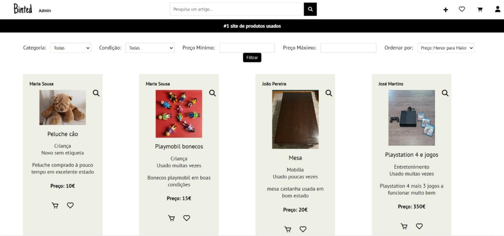
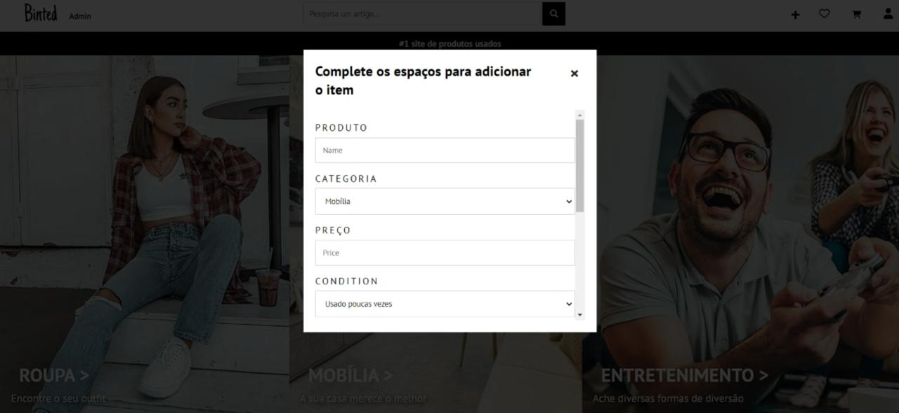
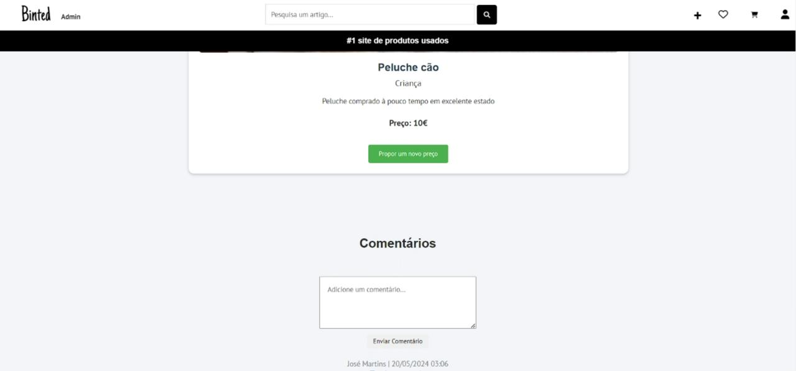
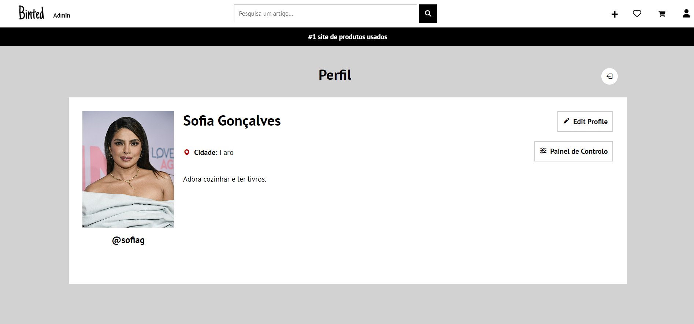
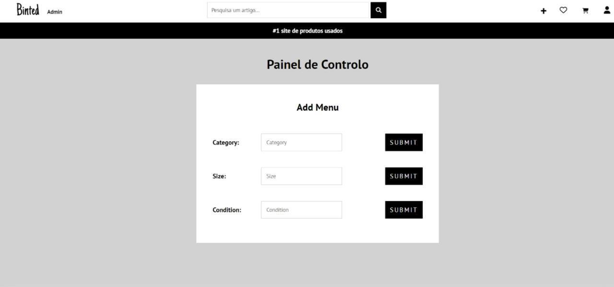

# Binted

## Group ltw12g04

- Beatriz Sonnemberg (up202206098) 100%
- Tomás Teixeira (up202208041) 100%
- Tomás Telmo (up202206091) 0%

## Install Instructions

    git clone git@github.com:FEUP-LTW-2024/ltw-project-2024-ltw12g04.git
    git checkout final-delivery-v1
    sqlite database/database.db < database/database.sql
    php -S localhost:9000

## Screenshots

  

  

  

  

  

  

## Implemented Features

**General**:

- [X] Register a new account.
- [X] Log in and out.
- [X] Edit their profile, including their name, username, password, and email.

**Sellers**  should be able to:

- [X] List new items, providing details such as category, brand, model, size, and condition, along with images.
- [X] Track and manage their listed items.
- [X] Respond to inquiries from buyers regarding their items and add further information if needed.
- [X] Print shipping forms for items that have been sold.

**Buyers**  should be able to:

- [X] Browse items using filters like category, price, and condition.
- [X] Engage with sellers to ask questions or negotiate prices.
- [X] Add items to a wishlist or shopping cart.
- [X] Proceed to checkout with their shopping cart (simulate payment process).

**Admins**  should be able to:

- [X] Elevate a user to admin status.
- [X] Introduce new item categories, sizes, conditions, and other pertinent entities.
- [X] Oversee and ensure the smooth operation of the entire system.

**Security**:
We have been careful with the following security aspects:

- [X] **SQL injection**
- [X] **Cross-Site Scripting (XSS)**
- [X] **Cross-Site Request Forgery (CSRF)**

**Password Storage Mechanism**: md5 / sha1 / sha256 / hash_password&verify_password

**Aditional Requirements**:

We also implemented the following additional requirements (you can add more):

- [X] **Proposal prices Features**
